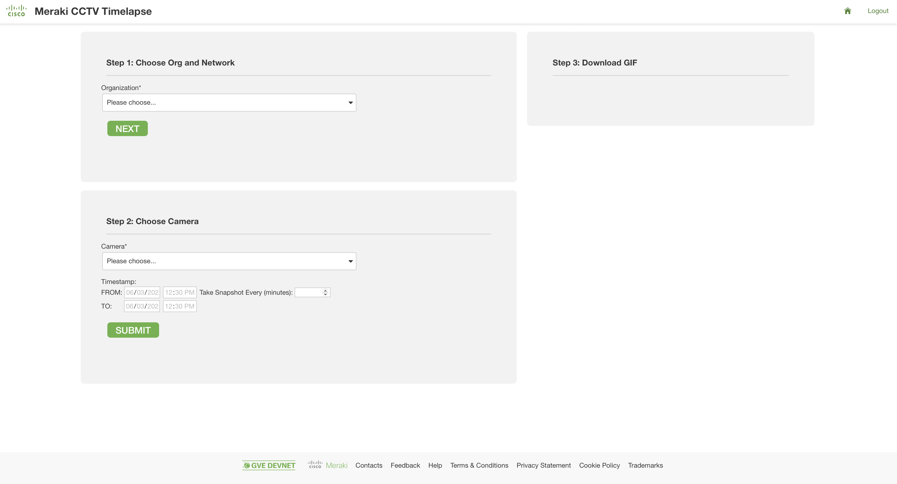
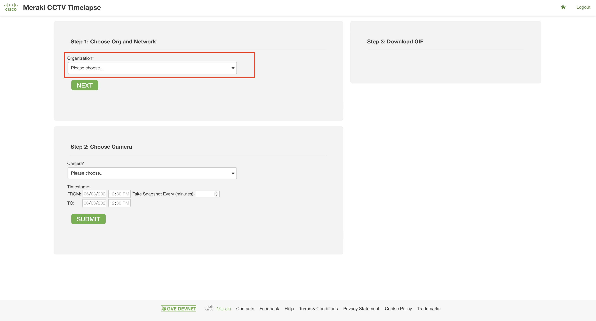
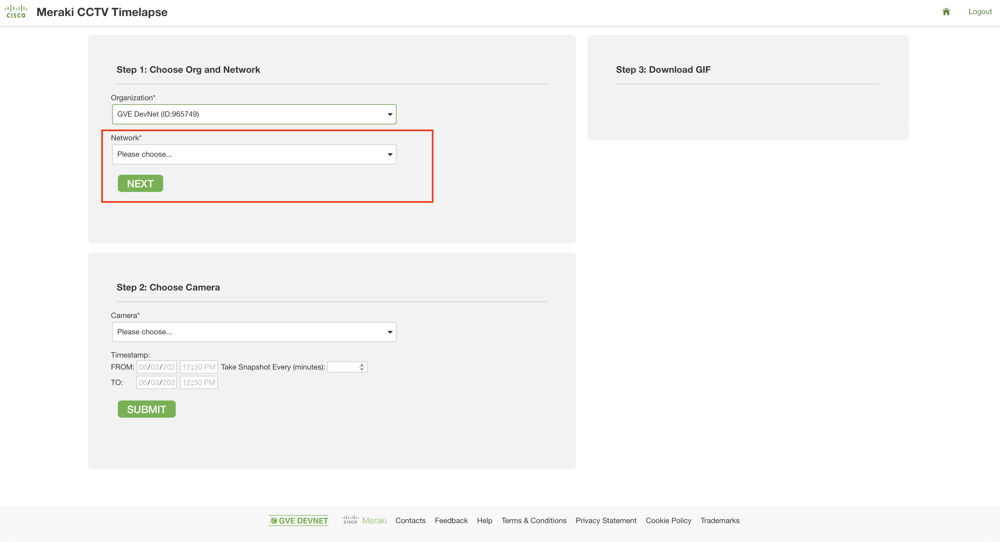
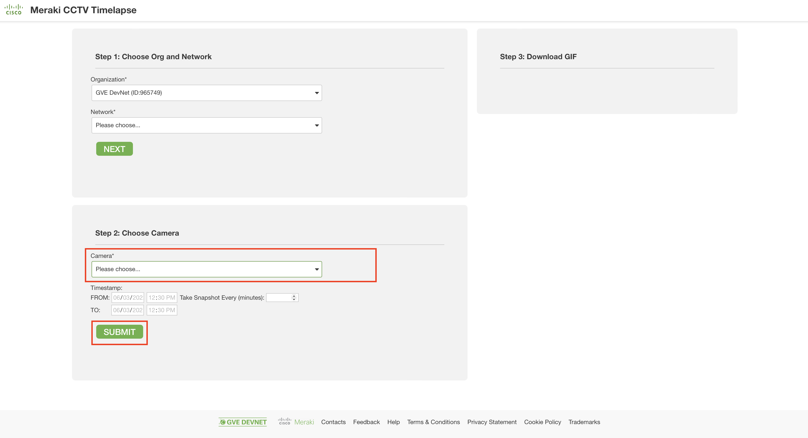
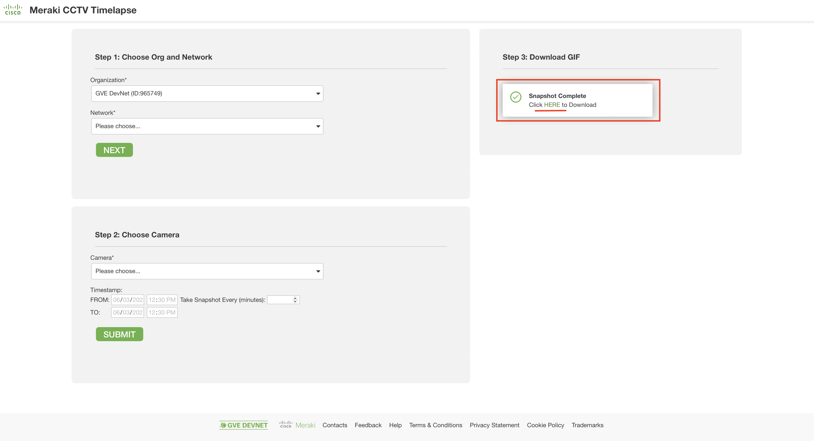

# GVE DevNet Meraki Camera Timelapse Tool
This prototype allows to generate a timelapse of Meraki camera snapshots. Given a user's input of (1) a Meraki network, (2) a Meraki Camera (3) the timestamp to create the timelapse, the tool generates the timelapse and provides a link to download it.

## Contacts
* Stien Vanderhallen
* Roaa Alkhalaf

## Solution Components
* Meraki REST API
* Meraki Snapshot API
* Meraki


## Installation/Configuration
The following commands are executed in the terminal.

1. Set up a Python virtual environment. Make sure Python 3 is installed in your environment, and if not, you may download Python [here](https://www.python.org/downloads/). 
Once Python 3 is installed in your environment, you can activate the virtual environment with the instructions found [here](https://docs.python.org/3/tutorial/venv.html). 

2. Access the created virtual environment folder

        $ cd your_venv

3. Clone this repository

        $ git clone https://wwwin-github.cisco.com/gve/gve_devnet_meraki_camera_timelapse.git

4. Access the folder `gve_devnet_meraki_camera_timelapse`

        $ cd gve_devnet_meraki_camera_timelapse

5. Install the dependencies:

        $ pip install -r requirements.txt

6. In `.env`, fill out your Meraki API key. Obtain this key in the Meraki dashboard, under `My Profile > API access`

```
API-Key=<your-meraki-api-key>
```

## Usage
1. To launch the app, type the following command in your terminal:

        $ python3 app.py

2. To access the app, navigate in a browser to `localhost:5004`


# Workflow

1. On `localhost:5004`, you find the landing page of the prototype



2. Choose the targeted Meraki organization 


3. Choose the targeted Meraki network and click on Next 


4. Choose the targeted Meraki camera and click on Submit. For testing purposes, don't modify the timestamp fields


5. Click on the green HERE hyperlink to access the created snapshot


# 


### LICENSE

Provided under Cisco Sample Code License, for details see [LICENSE](LICENSE.md)

### CODE_OF_CONDUCT

Our code of conduct is available [here](CODE_OF_CONDUCT.md)

### CONTRIBUTING

See our contributing guidelines [here](CONTRIBUTING.md)

#### DISCLAIMER:
<b>Please note:</b> This script is meant for demo purposes only. All tools/ scripts in this repo are released for use "AS IS" without any warranties of any kind, including, but not limited to their installation, use, or performance. Any use of these scripts and tools is at your own risk. There is no guarantee that they have been through thorough testing in a comparable environment and we are not responsible for any damage or data loss incurred with their use.
You are responsible for reviewing and testing any scripts you run thoroughly before use in any non-testing environment.
